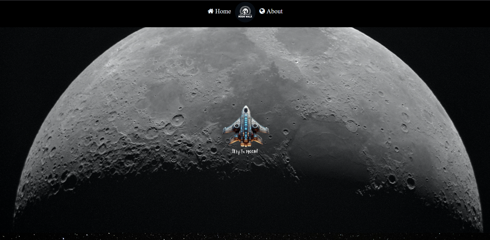

# Moon Walk 🚀🌕

[](https://astronil.github.io/Moon-Walk/)

**Live Demo:** [Moon Walk](https://astronil.github.io/Moon-Walk/)

📌 Overview

Moon Walk is a simple front-end project designed to showcase a visually appealing space-themed web page. It features smooth animations and interactive elements using HTML, CSS, and a bit of JavaScript.

🛠️ Technologies Used

HTML5 - Structure of the webpage

CSS3 - Styling, animations, and layout

JavaScript (Vanilla JS) - Minor interactivity enhancements

🎨 Features

Beautiful space-themed design with an animated background.

Smooth scrolling effects for an engaging experience.

Minimal JavaScript usage for light interactivity.

Fully responsive layout for different screen sizes.

🔧 Setup and Installation

Clone the repository:

```
git clone https://github.com/astronil/Moon-Walk.git
```

Open the index.html file in a browser.

Explore and enjoy the design!

📜 License

This project is open-source and available under the MIT License.

📞 Contact

For any inquiries or contributions, feel free to reach out:

GitHub: astronil

Email: anilpoudyal03@gmail.com
